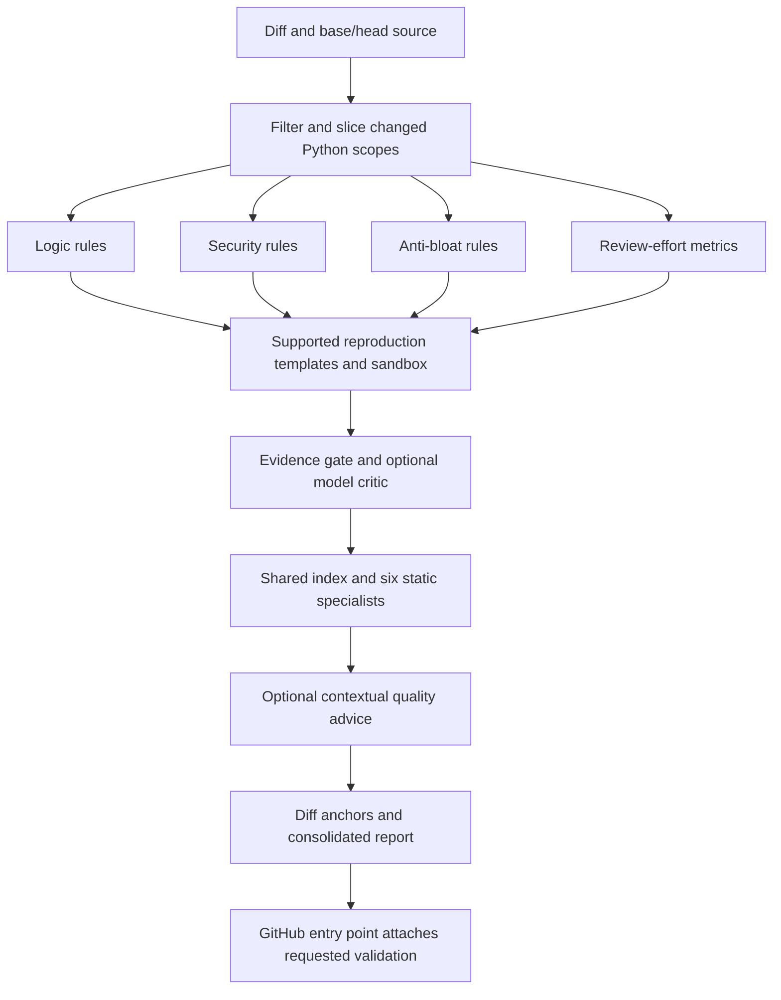

# Architecture and scope

[Back to README](../README.md) · [Configuration](configuration.md) · [Reports](reports.md)

[graph.py](../src/sentinel/graph.py) defines both LangGraph workflows. Source detection and metrics are deterministic; optional model stages evaluate supplied evidence and provide advisory judgments.

## PR flow

Triage uses changed line ranges and available full head files to extract enclosing Python scopes. The shared critic records retained and discarded candidates. PR specialist observations must intersect changed locations; matching fingerprints in supplied base source are suppressed.

Reproduction is currently template-based, principally for mutable-default candidates. Unsupported candidates remain untested. The default permits one setup/execution repair attempt. Reproduction uses the separate Docker [sandbox harness](../src/sentinel/harness/sandbox.py); missing infrastructure is not dynamic proof. It is not an LLM test-generation system.

## Repository flow

```mermaid
flowchart LR
    Collect[Bounded working-directory collection] --> Triage[Python scopes]
    Triage --> Rules[Logic / security / anti-bloat rules]
    Rules --> Critic[Shared critic and decision audit]
    Critic --> Quality[Static specialists]
    Quality --> Context[Contextual quality advice]
    Context --> Project[Project assessment]
    Project --> Report[Repository report]
    Report --> Checks[CLI attaches requested validation]
```

The three code-rule nodes fan out in parallel. Repository mode includes unchanged eligible files and skips the PR reproduction stage. Project assessment combines deterministic inventory advice with one optional model call; that call receives a bounded summary of earlier contextual decisions.

## Static specialists

| Specialist | Implemented observations |
| --- | --- |
| Architecture | Witnessed module-import cycles and configured forbidden dependencies |
| Redundancy | Substantial matching function ASTs; unreachable statements after unconditional transfer |
| Performance | Constant regex compilation and query-like calls inside loops, as workload-dependent hypotheses |
| Readability | Function length and nesting thresholds |
| Maintainability | Branch-complexity estimates; related tests as context |
| Security | Direct local parameter-to-dynamic-execution hypotheses |

These are deterministic functions in [analyzers.py](../src/sentinel/quality/analyzers.py), not six independent model agents. Metric overlap is grouped for presentation; all source observations remain available.

## Context and trust boundaries

The [repository index](../src/sentinel/quality/index.py) supports repository-root and `src` module layouts, unconditional imports, direct calls to local/imported top-level functions, source retrieval, and related test modules. Methods, closures, re-exports, conditional imports, and dynamic dispatch can remain unresolved. It never imports the target to resolve relationships.

The contextual quality stage requires complete observed source to fit its budget, then adds available callers, callees, related tests, and dependencies. It validates structured responses and cited locations. Model failure or missing context leaves static observations available and does not change the blocking verdict.

The [project constitution](../AGENTS.md) defines three trust zones: perimeter validation is required; internal code should honor validated contracts and fail visibly; inter-module boundaries can validate contracts without hiding misconfiguration. Existing classification/rules approximate these policies rather than proving every function's trust boundary.

## Practical limits

Code analysis currently supports Python. Repository collection discloses recognized unsupported source files; PR mode should not be treated as a complete review of other languages. PR context is limited to supplied files; the GitHub loader supplies changed files, not the whole project for model reasoning.

General dead-code analysis, whole-program taint/authorization analysis, runtime profiling, measured test coverage, and exhaustive system-design review are not implemented. Adding more model agents would not by itself supply missing contracts or runtime evidence. Precision must be evaluated through [tests and labeled cases](development.md).
